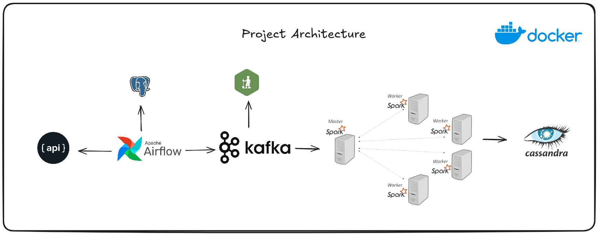

# Realtime Data Streaming | End-to-End Data Engineering Project

## Introduction

This project provides a detailed walkthrough for creating a full data engineering pipeline. It encompasses every phase from data collection to processing and storage, using a comprehensive technology stack. This stack includes Apache Airflow, Python, Apache Kafka, Apache Zookeeper, Apache Spark, and Cassandra. Docker is utilized to containerize all components, ensuring seamless deployment and scalability.

## System Architecture

The system architecture comprises the following elements:

- **Data Source**: Utilizes the `randomuser.me` API to generate user data for the pipeline.
- **Apache Airflow**: Manages pipeline orchestration and stores the ingested data in a PostgreSQL database.
- **Apache Kafka and Zookeeper**: Facilitate streaming of data from PostgreSQL to the processing engine.
- **Control Center and Schema Registry**: Essential for monitoring and managing schemas in Kafka streams.
- **Apache Spark**: Handles data processing through its master and worker nodes.
- **Cassandra**: Serves as the storage solution for processed data.

## Technologies

- Apache Airflow
- Python
- Apache Kafka
- Apache Zookeeper
- Apache Spark
- Cassandra
- PostgreSQL
- Docker

## Watch the Video Tutorial

This project is based in airscholar project of Realtime Data Streaming [Airscholar](https://github.com/airscholar).
